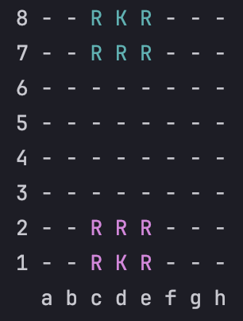

# ♟️ Java Chess Game (Console-Based)

This is a complete chess game developed in Java, running entirely in the console.

🚧 **This project is still under development and not yet finished.**



## 🚀 Features

- Full chessboard representation
- Valid movements for all pieces
- Check and checkmate detection
- Piece capturing and turn control
- Pawn promotion
- Invalid move handling

## 💡 Concepts Applied

- Object-Oriented Programming (OOP)
- Encapsulation, inheritance, and polymorphism
- Data structures (arrays, lists)
- Console input/output handling

## 🛠️ How to Run

1. Compile the project:
   ```bash
   javac application/Program.java

2. Run the game:
   ```bash
   java application.Program

## 📚 Credits

This project is based on the Java course by Professor Nelio Alves (Udemy), with personal adaptations and improvements.
